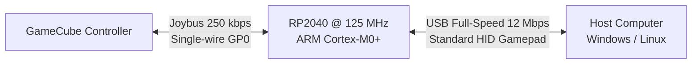

# GameCube Controller to USB Adapter Documentation

Welcome to the technical documentation for the bare-metal Raspberry Pi RP2040 GameCube controller to USB HID adapter.

---

## Documentation Navigation Hub

This documentation is split into modular chapters covering specific engineering facets of the project:

| Chapter | File | Description |
| :--- | :--- | :--- |
| **1. Hardware & Wiring** | [**`hardware.md`**](hardware.md) | Pinout diagrams, plug schematics, connection tables, voltage rails (3.3V logic, 5V rumble), and mandatory 2.0 kΩ pull-up resistor specifications. |
| **2. Protocol & Data Specs** | [**`protocol.md`**](protocol.md) | Nintendo Joybus 250 kbps physical layer, 2 µs sampling window, command/response cycles, USB HID descriptor, axis mappings, and Y-axis normalization. |
| **3. Firmware Architecture** | [**`firmware.md`**](firmware.md) | Bare-metal Rust design, zero-cost `Joybus<PIN>` driver, direct SIO single-cycle register manipulation, SRAM placement (`.data`), bounded timeouts, and the non-blocking USB event loop. |
| **4. Getting Started Guide** | [**`getting-started.md`**](getting-started.md) | Prerequisites, compilation target installation, building release binaries, flashing via `elf2uf2-rs`, and validating on Linux (`jstest`) and Windows (`joy.cpl`). |
| **5. Engineering Journey** | [**`development-journey.md`**](development-journey.md) | Comprehensive engineering retrospective and post-mortem: electrical hurdles, timing battles, Flash cache misses, USB host starvation, and lessons learned. |

---

## High-Level Architecture

### Key Technical Highlights
* **Zero Custom Drivers Needed:** Recognized natively by Windows, Linux, and macOS as a standard DirectInput Gamepad.
* **Jitter-Free 250 kbps Timing:** Time-critical code is linked directly into fast internal SRAM (`.data`), completely bypassing external SPI Flash cache latencies.
* **Deterministic 100 Hz Cadence:** Synchronized to the USB HID `bInterval = 10` standard, polling the controller every 10,000 µs via the RP2040 64-bit hardware timer.
* **Fail-Safe Timeouts:** Disconnecting or unplugging the controller is detected within 50 µs, preventing CPU stalls and USB enumeration crashes (Code 43).
* **Dual-Stick Windows Standardization:** Primary Stick mapped to `X`/`Y` and C-Stick mapped to `Rx`/`Ry` with automatic vertical inversion for natural PC gameplay.
