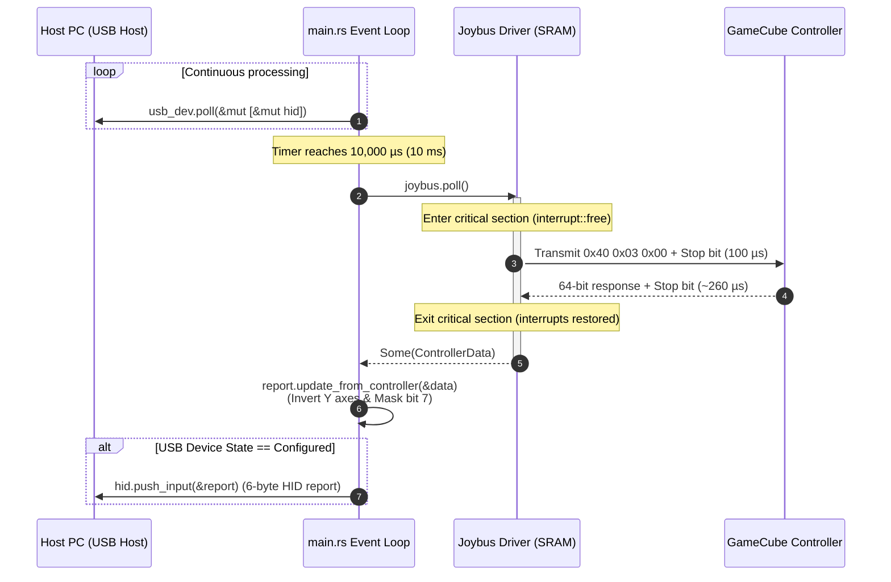

# Software and Firmware Architecture

This document describes the software design, execution model, and implementation details of the bare-metal Rust firmware running on the Raspberry Pi RP2040.

---

## 1. Modular Source Code Organization

The firmware source code is organized into three distinct modules under [`src/`](file:///c:/Users/Quentin%20D/Documents/travail/perso/Embedd/Gamecube-adapter-pi/src):

```
src/
├── main.rs      # System initialization, clock setup, USB polling, and event loop
├── joybus.rs    # Real-time Joybus driver (SIO registers, SRAM placement, timeouts)
└── usb_hid.rs   # USB HID report descriptor, data normalization, and axis conversion
```

---

## 2. Low-Level Joybus Driver ([`src/joybus.rs`](../src/joybus.rs))

The `joybus` module implements the physical communication routines with strict microsecond accuracy.

### 2.1 Zero-Cost Generic Abstraction
The driver is parameterized with a compile-time GPIO pin number:
```rust
pub struct Joybus<const PIN: usize>;

impl<const PIN: usize> Joybus<PIN> {
    const PIN_MASK: u32 = 1 << PIN;
    // ...
}
```
* **Why const-generics?** The pin mask `Self::PIN_MASK` is evaluated by the compiler at compile time and embedded as an immediate constant operand in ARM assembly. It incurs zero memory footprint and zero runtime shift overhead.

### 2.2 Direct SIO (Single-Cycle IO) Hardware Access
Standard HAL pin write abstractions introduce function call frames and safety checks that consume tens of clock cycles. Joybus requires exact 1.0 µs pulses (125 CPU cycles at 125 MHz). 

The driver bypasses high-level wrappers and talks directly to the RP2040's **SIO** register block:
```rust
#[inline(always)]
fn pull_low(&self, sio: &pac::sio::RegisterBlock) {
    unsafe {
        sio.gpio_out_clr().write(|w| w.bits(Self::PIN_MASK));
        sio.gpio_oe_set().write(|w| w.bits(Self::PIN_MASK));
    }
}

#[inline(always)]
fn float_high(&self, sio: &pac::sio::RegisterBlock) {
    unsafe {
        sio.gpio_oe_clr().write(|w| w.bits(Self::PIN_MASK));
    }
}

#[inline(always)]
fn is_high(&self, sio: &pac::sio::RegisterBlock) -> bool {
    (sio.gpio_in().read().bits() & Self::PIN_MASK) != 0
}
```
* **Driving LOW:** Writing to `gpio_out_clr` clears the output bit, and `gpio_oe_set` enables the output driver. The pin pulls the line to GND.
* **Releasing HIGH:** Writing to `gpio_oe_clr` disables the output driver. The pin becomes high-impedance, and the pull-up resistor brings the line to 3.3V.

### 2.3 SRAM Code Placement (`#[link_section = ".data"]`)
By default, microcontroller code is executed from external QSPI Flash via an Execute-in-Place (XIP) cache. Cache misses cause unpredictable stalls of dozens of CPU cycles.

All time-critical functions (`wait_us`, `send_bit`, `send_byte`, `poll`) are decorated with:
```rust
#[link_section = ".data"]
```
This forces the linker to copy these routines into the RP2040's internal **SRAM** during startup, ensuring zero cache-miss jitter and cycle-accurate execution.

### 2.4 Fail-Safe Bounded Timeouts
Previous implementations used an unbounded iteration counter (`timeout > 100_000`) inside a critical section, locking the CPU for up to 8 ms when no controller was connected.

The driver now bounds wait loops using the hardware timer:
* **Initial Response Timeout (50 µs):** If the controller fails to pull the line low within 50 µs following the stop bit, the function aborts immediately and returns `None`.
* **Bit Recovery Timeout (15 µs):** If the line remains low for more than 15 µs, the function aborts and returns `None`.
* **Interrupt Shielding:** The query executes inside `cortex_m::interrupt::free`. If a timeout occurs, the function exits in under 50 µs, completely preventing USB packet drops or host timeouts.

---

## 3. USB HID Subsystem ([`src/usb_hid.rs`](../src/usb_hid.rs))

This module defines the USB report layout and handles controller data conversion.

### 3.1 Report Struct & Initialization
```rust
pub struct GamepadReport {
    pub x: u8,
    pub y: u8,
    pub rx: u8,
    pub ry: u8,
    pub buttons_1: u8,
    pub buttons_2: u8,
}

impl GamepadReport {
    pub const fn neutral() -> Self {
        Self {
            x: 128,
            y: 128,
            rx: 128,
            ry: 128,
            buttons_1: 0,
            buttons_2: 0,
        }
    }
}
```
The `neutral()` constructor centers all sticks at `128` with all buttons released, ensuring a safe fallback state when the controller is disconnected.

### 3.2 Update Method
```rust
pub fn update_from_controller(&mut self, data: &ControllerData) {
    self.buttons_1 = data.buttons_1;
    self.buttons_2 = data.buttons_2 & 0x7F; // Mask bit 7

    self.x = data.stick_x;
    self.y = 255_u8.saturating_sub(data.stick_y); // Invert vertical axis

    self.rx = data.c_stick_x;
    self.ry = 255_u8.saturating_sub(data.c_stick_y); // Invert vertical axis
}
```

---

## 4. Main Event Loop & Scheduling ([`src/main.rs`](../src/main.rs))

The main entry point configures the system clocks and runs the non-blocking execution loop.

### 4.1 System Initialization
1. **Clocks:** Configures System PLL to **125 MHz** and USB PLL to **48 MHz**.
2. **GPIO:** Enables the internal pull-up on `GP0` as an extra safeguard in addition to the external 2.0 kΩ resistor.
3. **USB Stack:** Allocates the USB bus, creates the `HIDClass` with a 10 ms polling interval (`bInterval = 10`), and initializes `UsbDevice` with VID `0x1209` and PID `0x0001`.

### 4.2 The Polling Loop
```rust
loop {
    // 1. Unconditionally service USB hardware events
    usb_dev.poll(&mut [&mut hid]);

    // 2. Query controller at deterministic 100 Hz cadence
    let now = timer.timerawl().read().bits();
    if now.wrapping_sub(last_poll) >= USB_POLL_INTERVAL_US {
        last_poll = now;

        if let Some(data) = joybus.poll() {
            report.update_from_controller(&data);
        }

        // 3. Stage HID report when device is configured
        if usb_dev.state() == UsbDeviceState::Configured {
            let _ = hid.push_input(&report);
        }
    }
}
```

### 4.3 Why Unconditional `usb_dev.poll()` is Essential
On Windows, when an interrupt endpoint is waiting for data, the host controller sends IN tokens. If the device buffer is empty, the hardware returns a NAK without triggering an event in `usb_dev.poll()`.

* **The Anti-Pattern:** Gating `push_input()` behind `if usb_dev.poll() { ... }` causes a deadlock on Windows: the host waits for data, while the device waits for an event before pushing data.
* **The Implemented Fix:** `usb_dev.poll()` runs continuously on every loop iteration to service bus traffic, while `push_input(&report)` is called at the regular 10 ms interval once `Configured`.

---

## 5. End-to-End Sequence Diagram (10 ms Cycle)


