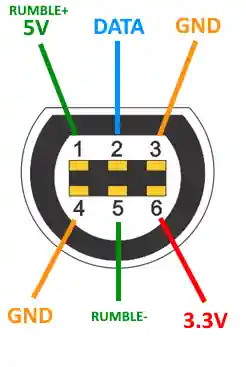

# Hardware and Wiring Specification

This document details the electrical characteristics, pinout specifications, and physical wiring required to connect an original Nintendo GameCube controller to the Raspberry Pi RP2040 microcontroller (such as the Raspberry Pi Pico).

---

## 1. Electrical Overview

The GameCube controller interface uses a custom synchronous serial bus called **Joybus**. The bus has specific electrical requirements:

* **Logic Power Rail (3.3V):** The controller's internal microcontroller and sensor board operate strictly on **3.3V DC**. Connecting 5V to the logic pin will permanently destroy the controller.
* **Open-Drain Bidirectional Signaling:** The communication line (DATA) operates in open-drain (open-collector) mode. Neither the console nor the controller actively drives the line to 3.3V; they only pull it to 0V (GND) or release it into high impedance.
* **Mandatory External Pull-Up Resistor:** Because the line is open-drain, an external pull-up resistor (nominally **2.0 kΩ** or **2.2 kΩ**) is required between the DATA wire and the 3.3V rail. Without this resistor, the line cannot rise back to 3.3V fast enough to register subsequent bits.
* **Rumble Motor Power Rail (5V):** The rumble vibration motor inside the controller runs on **5V DC**. Powering this pin is optional; if left disconnected, the controller and all buttons/sticks will function normally without vibration feedback.

```
       RP2040 (3.3V Logic)                     GameCube Controller
   +-------------------------+               +---------------------+
   |                     3V3 |---------------> Pin 6 (3.3V Logic)   |
   |                         |   2.0 kΩ      |                     |
   |                         |  Pull-Up      |                     |
   |                         |  +---[===]---+|                     |
   |                         |  |            |                     |
   |                     GP0 |<-+------------> Pin 2 (Bidirectional|
   |                         |               |        Data Line)   |
   |                     GND |---------------+ Pin 3 (Logic GND)   |
   |                         |               |                     |
   |          VBUS (5V USB)  |---------------> Pin 1 (Rumble Motor)|
   +-------------------------+               +---------------------+
```

---

## 2. GameCube Connector Pinout

The physical GameCube plug features 6 pins arranged in a polarized D-shell connector.



### Complete Pinout Table

| GC Pin | Name | Wire Color (Typical)* | Function | RP2040 Pin Connection | Notes |
| :---: | :---: | :---: | :--- | :--- | :--- |
| **1** | **5V** | Yellow | Rumble Motor Power | **VBUS** (5V USB) | Optional; only needed for rumble vibration. |
| **2** | **DATA** | Blue | Bidirectional Serial Data | **GP0** (Physical Pin 1) | **Must have 2.0 kΩ pull-up to 3.3V.** |
| **3** | **GND** | White | Logic Ground | **GND** (Physical Pin 3, 38, etc.) | Common electrical reference. |
| **4** | **GND** | Black | Rumble Motor Ground | **GND** | Can be tied together with Pin 3. |
| **5** | **N/C** | Green | Reserved / Not Connected | *Do not connect* | Leave disconnected. |
| **6** | **3.3V** | Red | Controller Logic Power | **3V3 (OUT)** (Physical Pin 36) | Regulated 3.3V supply from RP2040. |

> [!WARNING]
> *\*Wire colors inside aftermarket extension cables or dismantled controllers often vary depending on the manufacturer.* Always verify pin continuity using a digital multimeter before powering on the board.

---

## 3. Pull-Up Resistor and Signal Integrity

Joybus runs at 250 kbit/s, where high-speed 1 µs pulses dictate communication:

```
                  +3.3V
                    |
                   [ ] 2.0 kΩ - 2.2 kΩ Pull-Up Resistor
                    |
GP0 (RP2040) -------+------- DATA (GC Controller Pin 2)
```

1. **Why RP2040 internal pull-up is not enough:**
   The RP2040 has internal configurable pull-up resistors (~50 kΩ to 80 kΩ). At 50 kΩ, the RC time constant formed by the resistor and the wire capacitance is far too large: the line takes several microseconds to drift back to 3.3V, completely corrupting the 1 µs bit timing.
2. **Why 2.0 kΩ is optimal:**
   A 2.0 kΩ resistor delivers a crisp rise time of under 100 ns while drawing less than 1.65 mA when the pin is pulled low, staying well within safe sink currents for both the RP2040 and the controller microcontroller.

---

## 4. Hardware Assembly Checklist

Before connecting the device to a computer:
- [ ] Logic Ground (Pin 3) is securely soldered to RP2040 GND with no cold joints.
- [ ] 3.3V (Pin 6) is connected to RP2040 `3V3 (OUT)` and never connected to 5V.
- [ ] DATA (Pin 2) is connected to RP2040 `GP0`.
- [ ] A 2.0 kΩ or 2.2 kΩ resistor bridges `GP0` and `3V3 (OUT)`.
- [ ] Continuity test with a multimeter confirms no accidental short-circuits between 3.3V, DATA, and GND.
